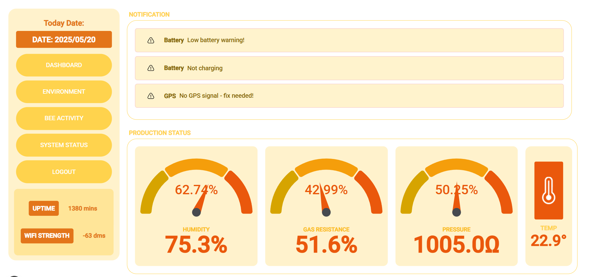

# Web Dashboard Interface

The Smart Beehive Monitoring System includes a companion web dashboard for visualizing and analyzing sensor data.

  

## Features

- Real-time data visualization of all beehive sensors
- Historical data analysis with trend charts
- Bee activity patterns visualization
- Weight tracking and honey production estimates
- Temperature and humidity correlation analysis
- Predator alert notifications and history
- Mobile-responsive design for monitoring on any device

## Dashboard Repository

The dashboard is maintained in a separate repository for better organization and independent development:

[Smart Beehive Monitor System Dashboard Repository](https://github.com/deaneeth/Smart-Beehive-Monitor-System-Dashboard)

## Integration

The web dashboard connects to the same Firebase Realtime Database that the ESP32 hardware uploads data to. This creates a seamless data flow:

1. ESP32 collects sensor data → 
2. Data is uploaded to Firebase → 
3. Dashboard retrieves and visualizes the data

  

## Key Screens

### Environmental Monitoring

  

### Bee Activity Analysis

  

### Weight Tracking

  

### Real-Time Location

  

### System Status

  

## Quick Setup

For detailed setup instructions, please refer to the dashboard repository. In brief:

1. Clone the dashboard repository
2. Install dependencies (`npm install`)
3. Configure Firebase credentials in `.env.local`
4. Run the development server (`npm run dev`)

See [FIREBASE.md](FIREBASE.md) for details on creating and configuring the Firebase project that connects both systems.