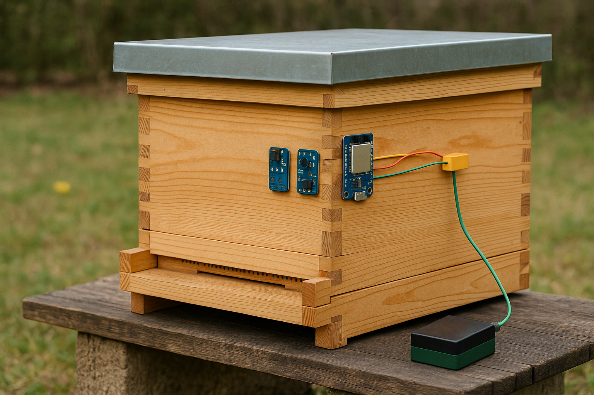

# 🐝 Smart Beehive Monitoring System

> ESP32-based IoT system that monitors beehive conditions and uploads data to Firebase in real-time, enabling beekeepers to remotely track hive health and activity.

  

## 📋 Overview

This project creates a comprehensive monitoring solution for beekeepers, providing real-time data on hive conditions, bee activity, weight changes, and potential threats. The system is solar-powered and designed for outdoor deployment with robust environmental protection.

## ✨ Features

### Environmental Monitoring
- 🌡️ Temperature, humidity, air pressure monitoring
- 🌱 VOC detection for air quality assessment
- 📊 Historical data tracking and trend analysis

### Bee Activity Tracking
- 👁️ Infrared bee movement detection at hive entrance
- 📈 Activity pattern recognition and anomaly detection
- 🔍 Combined entry/exit tracking for overall colony activity

### Weight Monitoring
- ⚖️ Continuous hive weight tracking with 100kg load cell
- 📆 Seasonal trend analysis
- 🍯 Harvest timing optimization

### Advanced Features
- 🚨 Predator detection with motion sensing
- 📍 GPS location tracking for anti-theft
- ☀️ Solar power system with battery management
- 📱 Real-time Firebase database integration
- 🌐 Web dashboard visualization

## 🛠️ Hardware

### Main Components
- ESP32-WROOM-32U Development Board
- BME680 Environmental Sensor
- TCRT5000 IR Sensor Array (2 kits)
- ADS1115 ADC Modules (2x)
- 100kg Load Cell with HX711 Amplifier
- HC-SR501 PIR Motion Sensor
- NEO-6M GPS Module

### Power System
- 18650 3.7V 3500mAh Batteries (2x)
- 5W 8.8V Solar Panel
- TP4056 Charging Module
- MT3608 DC-DC Step-Up Module

## 📝 Documentation

- [Wiring Guide](WIRING.md) - Detailed connection instructions
- [Firebase Setup](FIREBASE.md) - Database configuration steps
- [Web Dashboard](DASHBOARD.md) - Web interface setup
- [Component List](docs/BOM.md) - Complete bill of materials

## ⚙️ Setup & Installation

### Prerequisites
- PlatformIO IDE
- Firebase Account
- Required libraries (configured in platformio.ini)

### Quick Start
1. Clone this repository
2. Open in PlatformIO
3. Configure WiFi and Firebase credentials
4. Upload to ESP32
5. Follow calibration steps in [SETUP.md](SETUP.md)

## 📊 Data Structure
